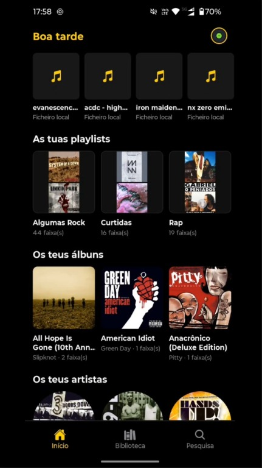
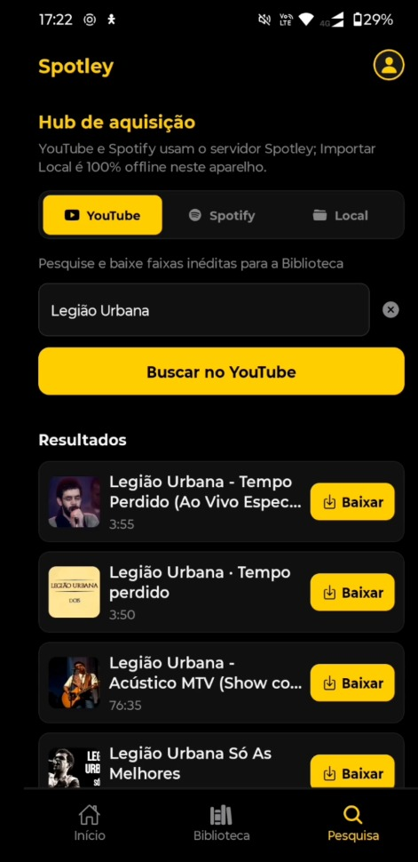
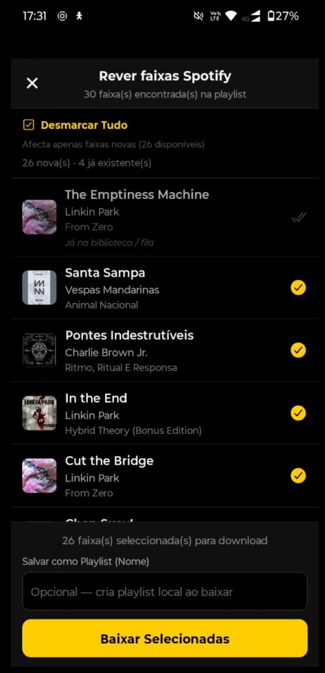
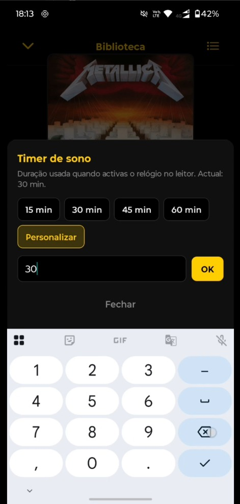
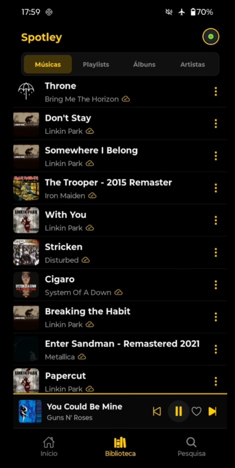
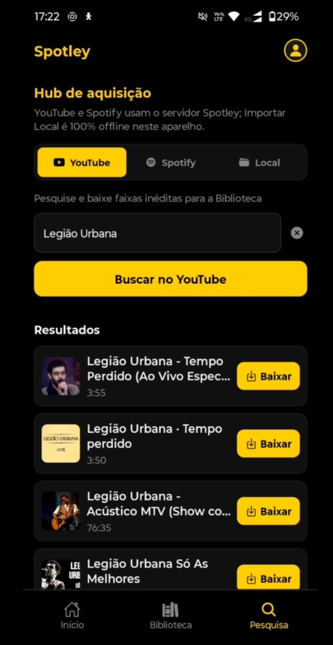
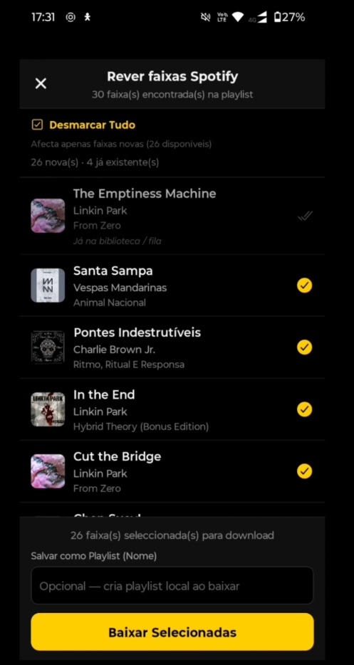
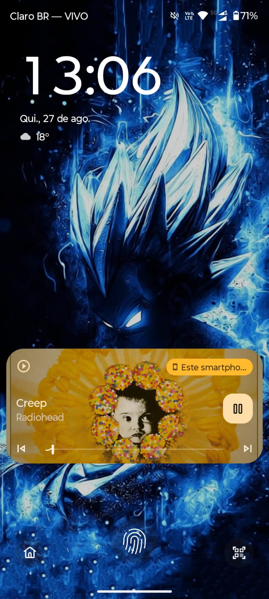
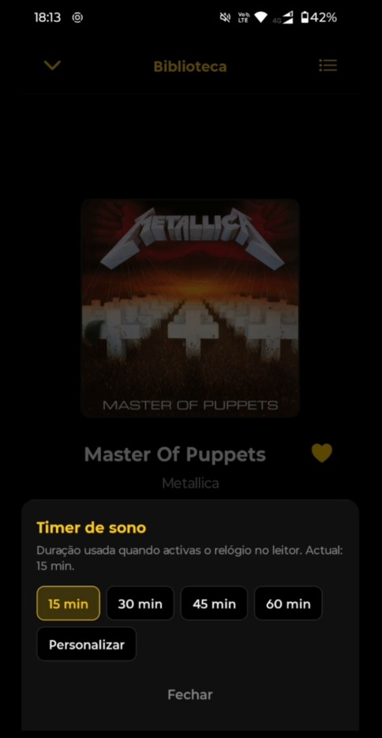
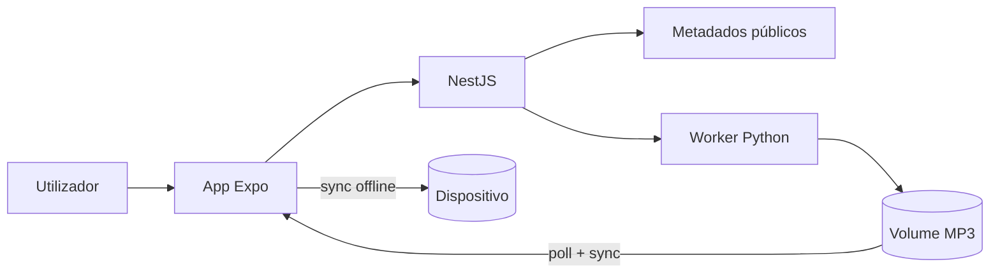

# Spotley — Case Study de Engenharia de Software

> Player de música **Local-First** (Android + Web) · NestJS + Python + Expo · Docker  
> **Showcase público** — arquitetura, decisões e demos. O código-fonte permanece em repositório **privado**.

[](#stack-tecnológica)
[](#stack-tecnológica)
[](#stack-tecnológica)
[](#stack-tecnológica)
[](#princípios-de-design)

---

## TL;DR (para recrutadores)

Desenvolvi de ponta a ponta um player de música pessoal sob o paradigma **Local-First**: o celular é a fonte de verdade; o servidor só busca, converte e enfileira áudio.

| Dimensão | Entrega |
|----------|---------|
| **Papel** | Full-stack solo — produto, system design e implementação |
| **Cliente** | Expo / React Native (Android APK + Web) · player em background · offline |
| **API** | NestJS · Swagger · JWT Firebase · fila server-driven |
| **Worker** | FastAPI + yt-dlp + ffmpeg em Docker |
| **Prova** | Série de 4 vídeos no LinkedIn · screenshots abaixo |

> Projeto pessoal de **portfólio / estudo**. Sem fins comerciais. **Código não é público.**

---

## Série de vídeos (LinkedIn)


| Parte | Tema | Capa | Assistir |
|-------|------|------|----------|
| **1** | Visão geral + Modo Avião (Local-First) | [](https://lnkd.in/p/dFQynx76) | [Abrir no LinkedIn →](https://lnkd.in/p/dFQynx76) |
| **2** | Downloads em 2º plano (fila Server-Driven) | [](LINK_LINKEDIN_PT_2) | [Abrir no LinkedIn →](https://lnkd.in/p/dFQynx76) |
| **3** | Metadados públicos + dedupe local | [](LINK_LINKEDIN_PT_3) | [Abrir no LinkedIn →](https://lnkd.in/p/dFQynx76) |
| **4** | Player nativo + Timer de Sono | [](LINK_LINKEDIN_PT_4) | [Abrir no LinkedIn →](https://lnkd.in/p/dFQynx76) |

### Resumo técnico da série

**Pt. 1 — Local-First / Modo Avião**  
Cold boot e biblioteca offline: capas, playlists e player continuam com Wi‑Fi/dados desligados. Backend = ponte de aquisição; o dispositivo manda.

**Pt. 2 — Downloads Server-Driven**  
React Native solicita → NestJS enfileira → worker Python no Docker converte. Minimizar o app não cancela o lote; o cliente só faz poll + sync do MP3.

**Pt. 3 — Metadados + deduplicação**  
Motor de extração de metadados públicos no NestJS (estudo/portfólio). Review Screen cruza IDs com AsyncStorage e desmarca o que já existe offline.

**Pt. 4 — Player nativo + Sleep Timer**  
Serviço em background, controles na lock screen e Timer de Sono que encerra o serviço nativo de forma graciosa (bateria/memória).

---

## Screenshots do produto

### Biblioteca + Modo Avião



### Busca + downloads



### Review de playlist



### Lock screen / player em background



### Timer de Sono



---

## O problema

1. Apps cloud-first param sem rede  
2. Downloads no telemóvel morrem ao minimizar o app  
3. APIs oficiais de metadados nem sempre são viáveis (custo / regras)  
4. Player mobile “de verdade” exige stack nativa (background, lock screen, bateria)

**Resposta:** arquitetura Local-First em 3 camadas, com fila no servidor e persistência offline no Android.

---

## Princípios de design

| Princípio | Na prática |
|-----------|------------|
| **Local-First** | Dispositivo = única fonte de verdade (ficheiros + AsyncStorage) |
| **Separação de responsabilidades** | API orquestra · Worker processa · Mobile persiste/reproduz |
| **Servidor de baixa** | Conversão no Docker independente do ciclo de vida do app |
| **Fail-safe** | Retry, dedupe, empty states, guards de player |
| **Custo controlado** | Open-source stack · Docker local · tiers gratuitos de cloud |

---

## Arquitetura

```text
┌────────────────────────────────────────────────────────────┐
│  CLIENTE  Expo / React Native (Web + Android APK)          │
│  Track Player · AsyncStorage · File System · SAF           │
└────────────────────────────┬───────────────────────────────┘
                             │ REST + JWT Firebase
┌────────────────────────────▼───────────────────────────────┐
│  API  NestJS · Swagger · fila bulk-add · metadados         │
└────────────────────────────┬───────────────────────────────┘
                             │ POST /process
┌────────────────────────────▼───────────────────────────────┐
│  WORKER  FastAPI · yt-dlp · ffmpeg  (Docker)               │
└────────────────────────────┬───────────────────────────────┘
                             │ volume
                      [(staging MP3)]
```



---

## Stack

| Camada | Tecnologias |
|--------|-------------|
| **API** | NestJS · TypeScript · Mongoose · Swagger · Firebase Admin |
| **Worker** | Python · FastAPI · yt-dlp · ffmpeg |
| **Mobile** | Expo · React Native · Track Player · React Navigation · AsyncStorage |
| **Infra** | Docker Compose · MongoDB Atlas · Firebase Auth |

---

## Trade-offs

| Escolhi | Em vez de | Porquê |
|---------|-----------|--------|
| Local-First no device | Catálogo cloud como truth | Offline real; PC pode desligar |
| Worker Python separado | Tudo no NestJS | Isolar CPU (yt-dlp/ffmpeg) |
| Fila no servidor | Download só no telemóvel | Minimizar app ≠ cancelar lote |
| Extração de metadados públicos | API Premium obrigatória | Viabilidade do estudo pessoal |
| Showcase + vídeos | Código público | Recrutadores veem decisões sem expor o repositório privado |

---

## Nota importante

- Este repositório contém **apenas** documentação, imagens e links.  
- **Não há código-fonte** aqui.  
- Projeto **pessoal / educacional / portfólio**, sem fins comerciais.

**Contacto:** <!-- cole o link do seu perfil LinkedIn -->

**Contacto:** 
* 💼 **LinkedIn:** [linkedin.com/in/wesleycorrealeite](https://www.linkedin.com/in/wesleycorrealeite)
* ✉️ **E-mail:** [West.correa@gmail.com](mailto:West.correa@gmail.com)
* 🐙 **GitHub:** [github.com/West-Correa/Spotley-Showcase](https://github.com/West-Correa/Spotley-Showcase)


---

## Tags

`local-first` · `offline-first` · `nestjs` · `fastapi` · `react-native` · `expo` · `docker` · `system-design` · `microservices` · `portfolio`

---

*Spotley · case study full-stack · 2025–2026*
